# Liquium - Multi-Chain Yield Aggregation Protocol

> Cross-chain LP token aggregation with Yellow Network, LayerZero, and Flare integration

---

## 🎯 System Overview

Liquium enables **cross-chain yield aggregation** where:
- Partners create deals on **Flare Network** with incentive structures
- Users deposit LP tokens from **any blockchain**
- Funds are bridged to Flare via **Yellow Network** (or LayerZero fallback)
- Rewards are claimed daily and credited to **Yellow virtual balances**
- Users withdraw to their **original source chain**
- Backend orchestration runs on **Fluence DePIN**
- Price data from **Flare FTSO oracles**

---

## 🏗️ Complete Architecture

---

## 🔄 User Journey Flowchart

---

## 🧩 Component Interactions

---

## ⏱️ Daily Reward Claim Process

```mermaid
sequenceDiagram
    participant Cron as Fluence Cron Job
    participant Backend as Fluence Backend
    participant Flare as Flare DealVault
    participant Protocol as Yield Protocol
    participant FTSO as FTSO Oracle
    participant Yellow as Yellow Virtual Balance
    participant Users as All Users

    Note over Cron: Every 24 hours

    Cron->>Backend: Trigger daily claim
    Backend->>Backend: Get all active deals

    loop For each active deal
        Backend->>Flare: claimRewardsFromProtocol(dealId)
        Flare->>Protocol: getAccumulatedRewards()
        Protocol-->>Flare: Return reward tokens

        Flare->>FTSO: getCurrentPrice(rewardToken)
        FTSO-->>Flare: Return price

        Flare->>Backend: Emit RewardsClaimed(dealId, amount, price)

        Backend->>Backend: Get all positions for deal
        Backend->>Backend: Calculate totalDeposited

        loop For each user position
            Backend->>Backend: userReward = (userDeposit / totalDeposit) × totalReward
            Backend->>Yellow: creditVirtualBalance(user, userReward)
            Yellow->>Yellow: Update user balance
        end
    end

    Backend->>Users: Emit BalanceUpdated events
```

---

## 📚 Technology Stack Summary

| Layer | Technology | Purpose |
|-------|------------|---------|
| **L1 Settlement** | Flare Network | Deal management, FTSO oracles |
| **Bridge Primary** | Yellow Network | Fast state channel transfers |
| **Bridge Fallback** | LayerZero | Reliable cross-chain messaging |
| **Backend DePIN** | Fluence | Decentralized orchestration, cron jobs |
| **Price Oracles** | Flare FTSO | Decentralized price feeds |
| **Virtual Balances** | Yellow L2 | Reward crediting without gas |
| **Source Chains** | Any EVM | User deposit origin |
| **Frontend** | React + wagmi | Multi-chain wallet connection |